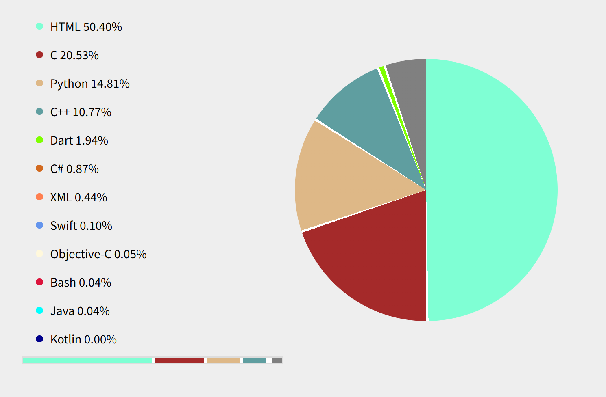
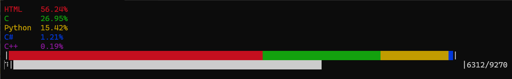

# LanguageScope

📊 **LanguageScope** 是一个轻量级工具，用于可视化分析指定文件夹中源代码的语言组成。支持将结果输出为终端彩色摘要或生成交互式 HTML 报告。

---

## 🚀 快速开始

### 依赖要求
- Python 3.6 或更高版本


### 安装依赖
```bash
pip install colorama
```

---

## ▶️ 使用方法

```bash
python scope.py <path> [-w]
```

### 参数说明
- `<path>`：要分析的文件夹路径（必需）
- `-w`（可选）：将分析结果保存为 `result.html` 文件

---

## 📸 示例截图

  
*生成的交互式 HTML 可视化报告*

  
*终端中的语言分布摘要*


---

## 📦 功能特点
- 自动识别常见编程语言（基于文件扩展名）
- 彩色终端输出，直观清晰
- 支持导出 HTML 报告，便于分享与存档
- 轻量、无第三方分析库依赖

---

> ✨ 欢迎提交 Issue 或 PR！让 LanguageScope 更强大！

